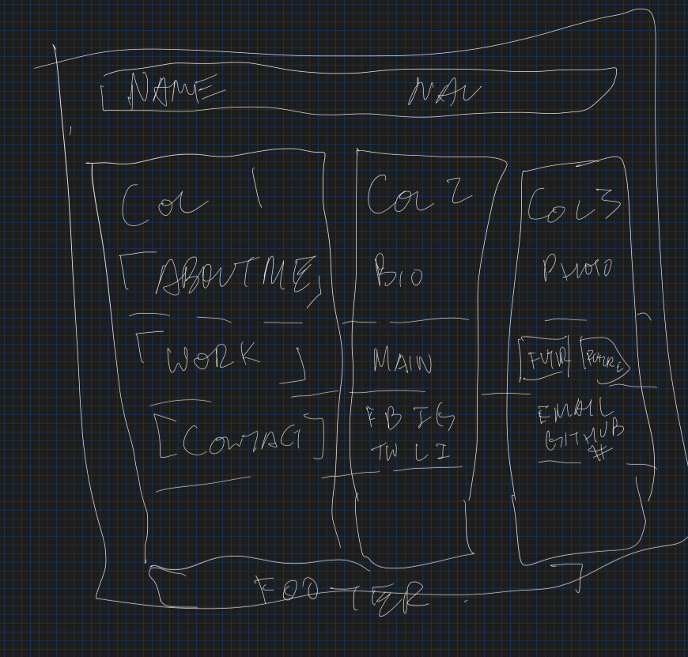
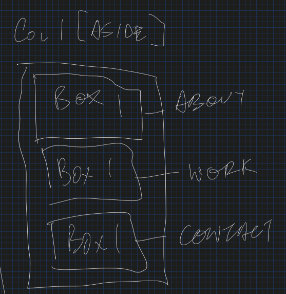
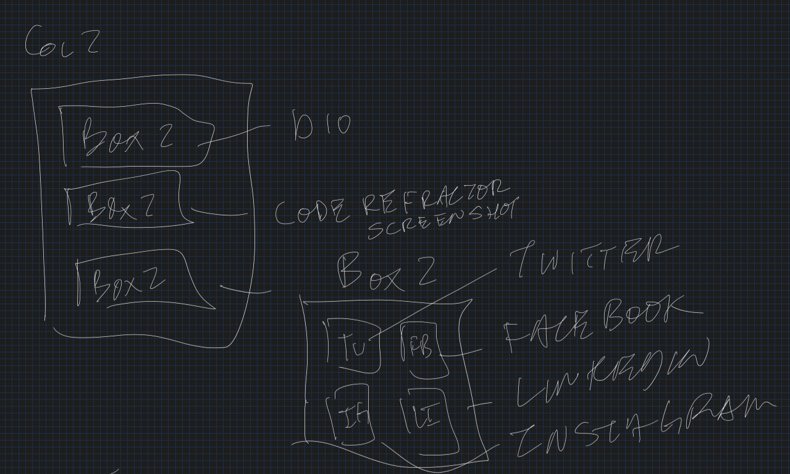
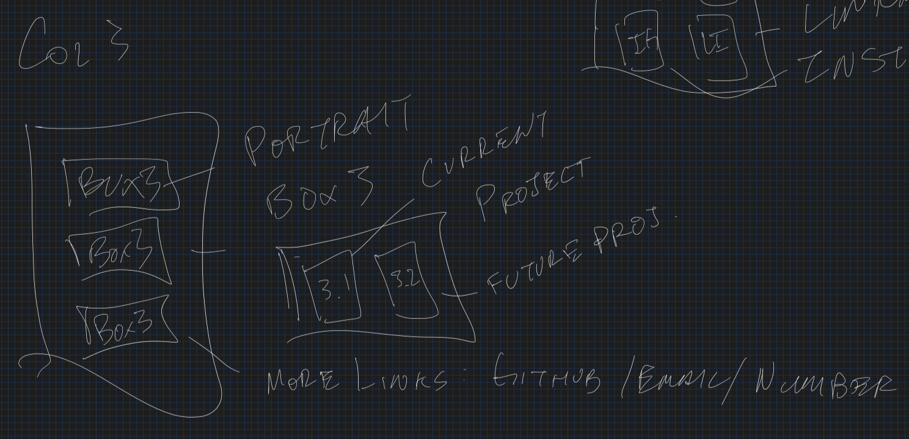

# HTML-CSS-GIT-Professional_Portfolio

Wrote out a basic sketch of what my webpage would look like
Then used Figma to get a more concrete visual of it

Realized that Figma would be somewhat overkill

Began to sketch more specifics:
    overall layout:
        
    column 1 layout:
        
    column 2 layout:
        
    column 3 layout:
        
    column 4 layout:
        

Deployed link:
https://hak9292.github.io/HTML-CSS-GIT-Professional_Portfolio/

updates:
I changed the method/approach I took and redesigned everything.

